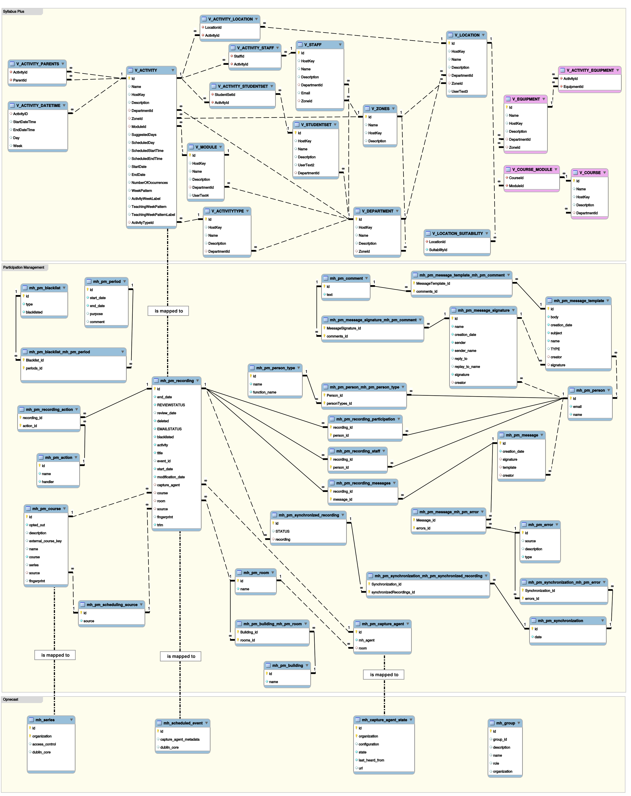

# Database Model

The Database model is split into 3 parts: 

 * **Syllabus Plus** is showing the tables of the reporting database of the scheduling 
tool. These are cut down versions of tables showing the columns used in the 
Participation Management modules to schedule recordings. The 4 tables shown in 
red are empty but as they are included in the DTOs they are needed at the moment.

 * **Participation Management** is showing the tables inside the Opencast database 
that are used to maintain the synchronization

 * **Opencast** shows the tables in the Opencast core that are affected in order 
to schedule the events for the actual recording



### Database Data File

The database data `sPlus-anon.sql` file that is provide in `docs/scripts/pm_data/` 
contains example data in a MySQL database that is based on the 2015/2016 academic 
year. The shell script `populate_Splus.sh` contains code to move the data into the 
immediate future. This script requires the user to create the local "SyllabusPlus" 
database and provide a user and password.
``` bash
#!/n/bash

# name of the SyllabusPlus database
db=SyllabusPlus

# database user 
user=sPlusUser

# password of this user
pass=sPlusOpen

.
.
.
```

 Once the script runs it populates the 
database and moves the dates of the Lectures into the following week. The days on 
which the recordings are scheduled will not change everything is just moved by a 
number of weeks calculated from the current date and the start date of the recordings.


### Opencast Database configuration

The Syllabus Plus database is configured in: 
`.../etc/services/org.opencastproject.pm.syllabus.SyllabusServicePublisher.properties`
```sh
# DB information for the Syllabus+ database

# defaults to 'Syllabus+'
#db.identity=Syllabus+
# defaults to 'SQLServer'
#db.vendor=SQLServer
# defaults to 'com.microsoft.sqlserver.jdbc.SQLServerDriver'
#db.driver=com.microsoft.sqlserver.jdbc.SQLServerDriver
# defaults to 'jdbc:sqlserver://localhost:1433;databaseName=sPlusDB'
#db.url=jdbc:sqlserver://localhost:1433;databaseName=sPlusDB
db.vendor=MySQL
db.driver=com.mysql.jdbc.Driver
db.identity=Syllabus+:Central_Timetable
db.url=jdbc:mysql://localhost:3306/SyllabusPlus
db.user=sPlusUser
db.password=sPlusOpen
#db.schema can be provided for databases that use this extra structural layer 
#db.schema=rdowner
```

Define the identity of the Database (default=`Syllabus+`):

```sh
db.identity=Syllabus+:Central_Timetable
```
This is used when you want to specify multiple scheduling sources.

Define the Vendor of the database (default=`SQLServer`):

```sh
db.vendor=MySQL
```

Define the database Driver (default=`com.microsoft.sqlserver.jdbc.SQLServerDriver`):

```sh
db.driver=com.mysql.jdbc.Driver
```

Define the database URL:

```html
db.url=jdbc:mysql://localhost:3306/SyllabusPlus
```

Define the database User:

```sh
db.user=sPlusUser
```

Define the database Password:

```sh
db.password=sPlusOpen
```

Some Databases (ie. MS SQL Server) use in addition to the database name and the 
table name a third tier the so called schema. Therfore the table would be 
addressed by: 

`database name` . `schema name` . `table name`

This additional level can optionally be specified:

```sh
db.schema=rdowner
```

MySQL is not using this 3rd level.