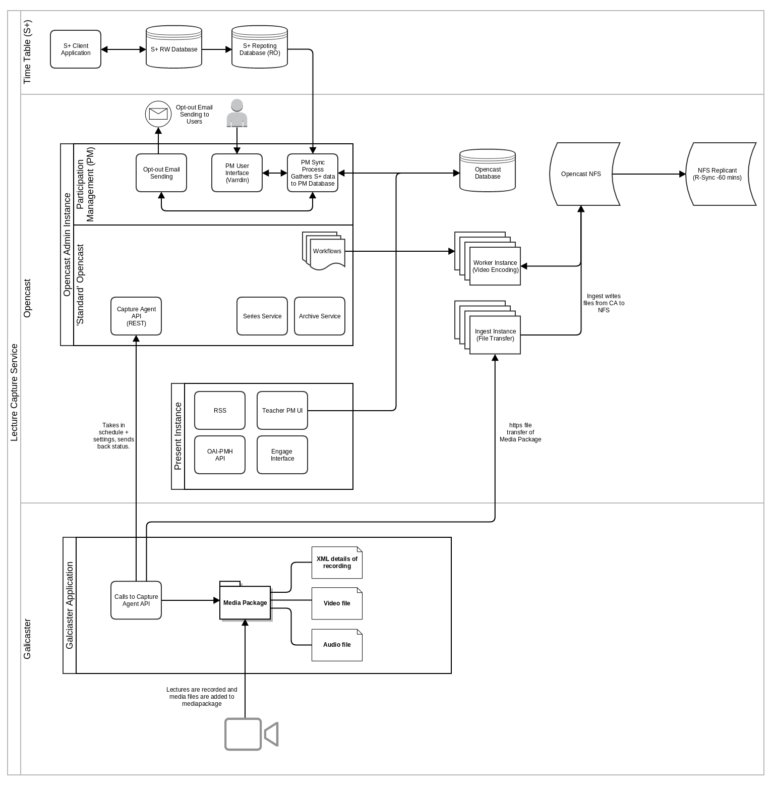
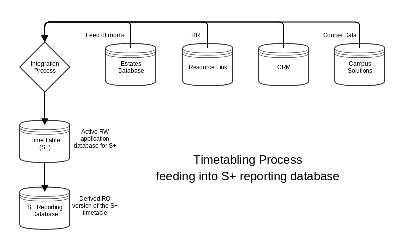

Opencast Participation Management Documentation
===============================================

This documentation introduces the Opencast Participation Management modules and 
the Synchronisation process of timetabling, email-processing, opting out, lecture 
recording, lecture post-processing (editing) and lecture delivery through the 
Opencast Engage utilities. 

### Introduction

The Participation Management modules provide a solution to automate the scheduling 
process. 

The modules read the scheduling data from a reporting database of the Scheduling 
tool (Syllabus Plus) in the provided example, and processes the schedule into an 
intermediate set of database tables inside the Opencast database. This data is
then used to send out emails that allow users to choose if the recording of the 
lecture is to go ahead. This is followed by a second synchronisation step where 
the recordings are scheduled in Opencast to take place. 

### System Overview

The following diagram shows the integration of the 3 main components of the Lecture 
Capture System - Timetabling (S+), Scheduling and processing (Opencast) and Recording 
(Galicaster). 

### Synchronisation Process

The synchronisation process is a two-step Process in order to avoid loss of data. 
This potential loss of data is based on the issue that the Syllabus Plus Reporting 
database is synchronised to the original Syllabus database which is constantly changing 
as this is the live time-tabling system of the entire university. The diagram below 
shows a rough sketch of the databases and systems involved to acquire the data into 
the Syllabus Plus reporting database

As this process involves a number of groups all over the university it has happened 
that a large number of entries in the reporting database change or disappear for a 
short period of time. If this happens to be while the Participation Management modules 
synchronise the PM tables with the S+ reporting database. The S+-harvester (`ParticipationFeederService`) 
would possibly delete a large number of Recordings in the PM tables which, if the 
Opencast Scheduler (`ScheduleFeederService`) would run automatically and unchecked, 
would lead to a large number of Opencast Recordings to be deleted.

The process:

* The [`ParticipationFeederService`](services.md#participation-feeder-service) harvests all events that are schedulde in a room 
that has rcording equipment and is of a type that the Feeder-Service is told to record. 
The room and capture-type specification is verified by the `capture.room.<title>.id` and  
`capture.type.<title>.id` which can be specified in the 
[Participation Feeder Service Configuration](modules/config.md#participation-feeder-service-configuration).
* 

