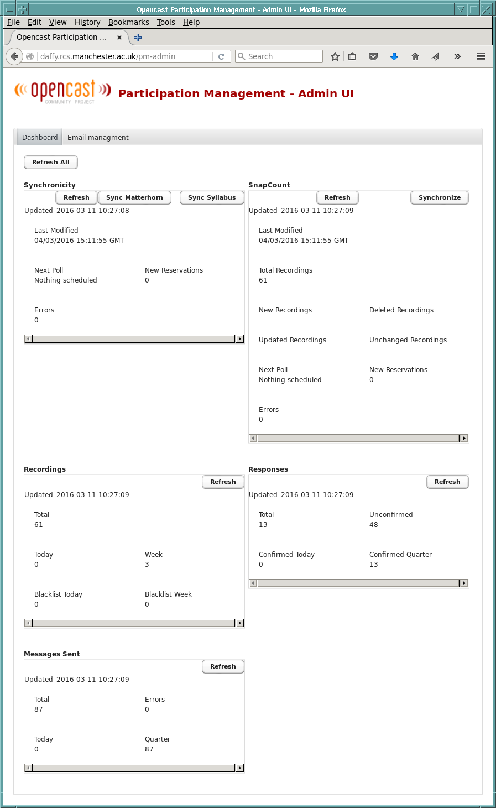
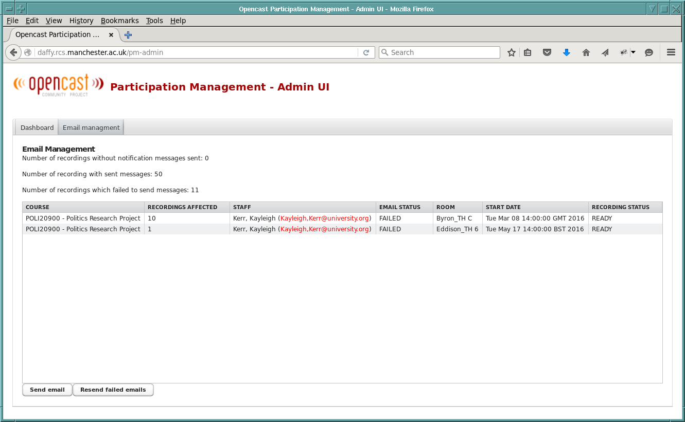
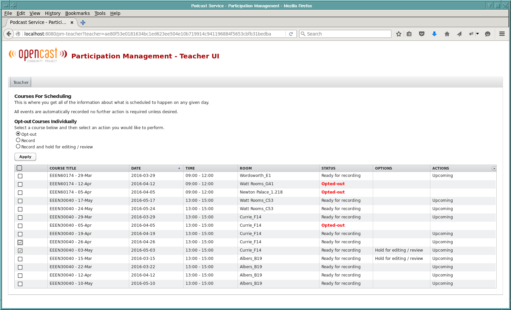

#User Interface Documentation

### Admin UI

The admin UI provides the Opencast Administrator access to the synchronization tools and email Management.



The admin UI is split into two Tabs :

* The **Dashboard** provides general interaction with the Participation management modules such as 
  triggering the Synchornization between Syllabus Plus and the PM tables as well as te triggering of 
  the Synchronization between the PM - tables and the Opencast scheduler. It is split into 5 panels:
    * **Synchronicity** allows the user to initiate both the synchronisation between the Syllabus 
      Plus Reporting Database and the PM database tables as well as the synchronisatiion between the 
      PM tables and the Opencast Scheduler. Both synchronisations are done as individual steps to 
      allow the user to interveen in the case of inconsitencies in the Syllabus Plus Scheduling.  
    * **SnapCount** is a new single step synchronisation tool that tries to combine both steps in 
      the Synchronicity panel. The SnapCount service contains some verifications steps to stop inconsistencies. 
      This service sends an error message to the administrator if it deems the result of the Syllabus Plus 
      to PM syncronization as unsafe to proceed to the PM-tables to Opencast scheduler synchronization.
    * **Recordings** is an information panel on how many recordings have been scheduled recently.
    * **Messages Sent** is an information panel that reports on the email sending 
    * **Responses** is an information panel that reports on how many responses have come back (ie. how 
      many lecturers have actively responded)
    
* The **Email Management** tab provides a user interface to send out invitation messages
   
  <br />
  <br />
  This panel allows the user to send the opt-out messages for all the courses that could be recorded. 
  The lecturer receives an email that mentions all the courses (s)he is teaching and is refered to a 
  link that offers the [Teacher UI](#teacher-ui). The UI presnts the number of recording for which a 
  message has been sent as well as the number of Recordings where the message sending has failed. If 
  an email fails to send the most common reason is that one of the email-addresses it was supposed to 
  be sent to is wrong. In that case the UI provides a list of all the emails which failed. 
  This list 
  contains: 
     * course description 
     * number of affected recordings 
     * members of staff concerned. This includes the email addresses. If the email address is not 
       valid it will be highlighted in red. 
     * email status
     * location of the Lecture
     * start date 
     * recrording status


Example email:

```html      
From: Lecture Capture <lecture-capture@university.org>
To: Atkins, Harry <HarryAtkins@university.org>
Subject: Lecture capture opt-out reminder - please ensure that your lecture recording options are correctly set

Dear Colleague,

I am writing to make you aware that the following unit(s) 
on which you teach have been scheduled to take place in 
venues which feature automated lecture capture technology. 
This email notification is sent to staff at the beginning 
of the semester or during the semester if we detect changes 
to the timetabling of your unit.

EEEN30040 - Computer Systems Architecture, Computer Systems Architecture
EEEN60174 - Signals, Sensors and Acquisition Systems, Signals, Sensors and Acquisition Systems

Note that no video cameras are used in the teaching environment,
but instead the lecture capture system directly records the output
the data projector and an audio track from the lecture theatre
microphones. The system has proven to be easy to use and popular
with students.

If a teaching event is scheduled the lecture capture system will
automatically detect it and schedule it for recording. 

Lastly, if you feel automated recording of your lectures is not
appropriate for your unit (for example, because chalk/white boards
etc. are not recorded), or you wish to opt-out for other reasons
please use the link below.

http://localhost:8080/pm-teacher?teacher=ae80f53e0181634bc1ed623ee504e10b719914c941196884f5653cbfb31bedba

If you are the unit coordinator for the above unit(s), please
forward this message to all staff teaching on your unit as, in
some cases, they may not be always be identified in the timetable
system and therefore may not be sent this message directly.
```
  
      
      
### Teacher UI

The Teacher UI is the only point of contact beween the Lecturer and the Lecture Capture System. It gives 
the Lecturer the option of selecting individual lectures to opt-in/opt-out the url of the page is sent to 
each lecturer concerned. There is also the choice to edit a recording.
 


The UI clearly highlights opted-out recordings.
